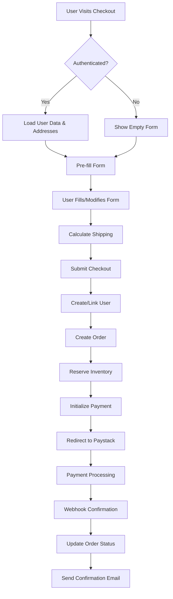

# MDV Checkout Form and User Data Flow Analysis

## Overview

This document provides a comprehensive analysis of the MDV e-commerce platform's checkout form and user data flow, covering the complete journey from user authentication through payment processing.

## 1. Architecture Overview

### Frontend Components
- **Checkout Page** (`web/app/checkout/page.tsx`) - Main checkout interface
- **Auth Context** (`web/lib/auth-context.tsx`) - Authentication state management
- **Cart Management** (`web/lib/cart.ts`) - Cart operations and persistence
- **API Routes** (`web/app/api/`) - Next.js API middleware for backend communication

### Backend Components
- **Checkout API** (`backend/api/routers/public.py`) - Order creation and payment initialization
- **User Management** (`backend/api/routers/users.py`) - Address management and user operations
- **Payment Processing** (`backend/mdv/paystack.py`) - Paystack integration and webhooks
- **Authentication** (`backend/api/routers/auth_v2.py`) - JWT-based authentication

## 2. User Authentication Flow

### Authentication Context
```typescript
interface AuthContextType {
  user: User | null
  isAuthenticated: boolean
  isStaff: boolean
  isCustomer: boolean
  loading: boolean
  // ... methods
}
```

### Session Management
- **Token Storage**: HTTP-only cookies (`mdv_token`, `mdv_role`)
- **Session Validation**: Automatic auth checks via `/api/auth/check`
- **Role-based Access**: Staff vs Customer role differentiation
- **Middleware Protection**: Route-level authentication enforcement

### User Data Structure
```typescript
interface User {
  id: string
  name: string
  email: string
  role: 'admin' | 'supervisor' | 'operations' | 'logistics'
  active: boolean
  created_at: string
  phone?: string
}
```

## 3. Checkout Form Structure

### Form State Management
```typescript
const [form, setForm] = useState({
  name: "",
  phone: "",
  state: "Lagos",  // Default value
  city: "",
  street: "",
  email: "",
  coupon: ""
});
```

### Form Validation
- **Required Fields**: name, phone, state, city, street, email
- **Email Validation**: HTML5 email type validation
- **Cart Validation**: Prevents empty cart submissions
- **Real-time Feedback**: Error states and loading indicators

### User Data Pre-filling
```typescript
// Pre-fill user name and email from auth context
setForm(prev => ({
  ...prev,
  name: user.name || prev.name,
  email: user.email || prev.email
}));
```

## 4. Address Management Integration

### Saved Addresses
- **API Endpoint**: `/api/users/addresses` (proxied to backend)
- **Data Structure**: 
  ```typescript
  interface UserAddress {
    id: number
    name: string
    phone: string
    state: string
    city: string
    street: string
    is_default: boolean
  }
  ```

### Address Selection UI
- **Visual Interface**: Blue-highlighted selection area
- **Default Address**: Automatically pre-fills form
- **One-click Selection**: Updates form state instantly
- **Loading States**: User feedback during data loading

## 5. Cart Management Flow

### Cart Persistence
- **Local Storage**: `mdv_cart_id` for session persistence
- **Backend Sync**: Cart data synchronized with server
- **Offline Support**: Backup cart data for offline scenarios
- **Auto-recovery**: Recreates cart if not found (404 handling)

### Cart Operations
```typescript
// Ensure cart exists
const cart_id = await ensureCartId();

// Fetch cart data
const res = await fetch(`${API_BASE}/api/cart/${cart_id}`);
```

### Cart Validation
- **Empty Cart Check**: Prevents checkout with empty cart
- **Stock Validation**: Server-side inventory verification
- **Reservation System**: 15-minute inventory holds during checkout

## 6. Shipping Calculation

### Real-time Estimates
```typescript
useEffect(() => {
  // Recalculate shipping when state or coupon changes
  const params = new URLSearchParams({ state: form.state });
  if (subtotal > 0) params.set("subtotal", String(subtotal));
  if (form.coupon) params.set("coupon_code", form.coupon);
  
  const resp = await fetch(`${API_BASE}/api/shipping/calculate?${params}`);
}, [form.state, form.coupon, cart]);
```

### Shipping Logic
- **Zone-based Pricing**: Lagos, North, Other regions
- **Free Shipping**: Lagos threshold-based free shipping
- **Coupon Integration**: Discount application affects shipping
- **State Dependency**: Shipping cost varies by delivery state

## 7. Checkout Initialization Process

### Backend Order Creation
```python
@router.post("/api/checkout/init")
async def checkout_init(body: CheckoutInitRequest, db: AsyncSession):
    # 1. Validate cart and items
    cart = await db.execute(select(Cart).where(Cart.id == body.cart_id))
    items = await db.execute(select(CartItem).where(CartItem.cart_id == cart.id))
    
    # 2. Create or find customer user
    user = await db.execute(select(User).where(User.email == body.email))
    if not user:
        user = User(
            name=body.address.name,
            email=body.email,
            role=Role.customer,  # Customer role
            password_hash=None     # No password for guest checkout
        )
    
    # 3. Create order and link to user
    order = Order(cart_id=cart.id, user_id=user.id)
    
    # 4. Calculate totals and apply coupons
    # 5. Create inventory reservations
    # 6. Initialize Paystack payment
```

### Order Data Structure
```python
class Order(Base):
    id: int
    user_id: Optional[int]  # Links to customer user
    cart_id: Optional[int]
    totals: Optional[dict]  # Pricing breakdown
    status: OrderStatus     # pending_payment, paid, etc.
    payment_ref: str        # Paystack reference
    created_at: datetime
```

## 8. Payment Integration (Paystack)

### Payment Initialization
```python
# Generate unique reference
reference = f"MDV-{order.id}-{int(datetime.now().timestamp())}"

# Paystack API call
init_payload = {
    "email": body.email,
    "amount": amount_kobo,  # Amount in kobo (₦1 = 100 kobo)
    "reference": reference,
    "currency": "NGN",
    "callback_url": f"{settings.app_url}/checkout/callback?order_id={order.id}&ref={reference}"
}
```

### Payment Flow
1. **Frontend**: Submits checkout form
2. **Backend**: Creates order, initializes Paystack
3. **Redirect**: User redirected to Paystack payment page
4. **Callback**: Paystack redirects to callback URL
5. **Webhook**: Paystack sends payment confirmation
6. **Fulfillment**: Order status updated, inventory decremented

### Mock Payment Support
```typescript
const useMock = process.env.NEXT_PUBLIC_ALLOW_MOCKS === 'true'
if (useMock && data.order_id && data.reference) {
  router.push(`/paystack-mock?order_id=${data.order_id}&ref=${data.reference}`)
}
```

## 9. Error Handling and User Experience

### Frontend Error Handling
- **Network Errors**: Graceful degradation with retry options
- **Validation Errors**: Real-time form validation feedback
- **Cart Errors**: Clear messaging for empty cart scenarios
- **Payment Errors**: User-friendly error messages

### Backend Error Handling
- **Stock Validation**: Prevents overselling with clear error messages
- **Cart Validation**: Handles missing or empty carts
- **Payment Failures**: Releases inventory reservations
- **Webhook Idempotency**: Prevents duplicate processing

### Loading States
- **User Data Loading**: Shows loading indicator while fetching addresses
- **Shipping Calculation**: "Calculating..." state during estimates
- **Form Submission**: Disabled button with loading text
- **Cart Loading**: Skeleton UI while cart data loads

## 10. Security Considerations

### Authentication Security
- **HTTP-only Cookies**: Prevents XSS token theft
- **CSRF Protection**: SameSite cookie attributes
- **Role-based Access**: Middleware-enforced permissions
- **Token Validation**: Server-side JWT verification

### Payment Security
- **Webhook Verification**: HMAC-SHA512 signature validation
- **Reference Uniqueness**: Prevents payment replay attacks
- **Inventory Reservations**: Prevents race conditions
- **Idempotent Processing**: Safe webhook retry handling

## 11. Performance Optimizations

### Frontend Optimizations
- **Lazy Loading**: Auth checks delayed for public pages
- **Debounced Calculations**: Shipping estimates with state changes
- **Local Storage**: Cart persistence reduces server calls
- **Conditional Rendering**: Address UI only for authenticated users

### Backend Optimizations
- **Database Indexing**: Optimized queries for orders and users
- **Eager Loading**: Relationships loaded efficiently
- **Connection Pooling**: Database connection management
- **Caching**: Static data caching where appropriate

## 12. Data Flow Summary



## 13. Integration Points

### Frontend-Backend Communication
- **API Base URL**: Environment-specific configuration (`API_BASE`)
- **Credential Handling**: Automatic cookie inclusion for authenticated requests
- **Error Propagation**: Consistent error handling across API boundaries
- **Type Safety**: TypeScript interfaces for API contracts

### Third-party Integrations
- **Paystack API**: Payment processing and webhook handling
- **Email Service**: Order confirmation and notifications
- **Shipping Providers**: Rate calculation and tracking integration
- **Analytics**: User behavior and conversion tracking

## 14. Testing Strategy

### End-to-End Testing
```typescript
// Checkout flow test (web/e2e/checkout.spec.ts)
test('complete checkout flow', async ({ page }) => {
  await page.goto('/checkout');
  await page.getByPlaceholder("Full name").fill("Test User");
  await page.getByPlaceholder("Email").fill("test@example.com");
  await page.getByRole("button", { name: /Pay with Paystack/i }).click();
});
```

### Mock Testing
- **Paystack Mock**: Development environment payment simulation
- **API Mocking**: Isolated frontend testing
- **Database Fixtures**: Consistent test data
- **Webhook Simulation**: Payment flow testing

## 15. Monitoring and Observability

### Logging Strategy
- **Checkout Events**: Order creation and payment initialization
- **Webhook Processing**: Payment confirmation tracking
- **Error Logging**: Comprehensive error capture and alerting
- **Performance Metrics**: Response time and conversion tracking

### Health Checks
- **API Endpoints**: Service availability monitoring
- **Database Connectivity**: Connection pool health
- **Payment Gateway**: Paystack service status
- **Email Delivery**: Notification system health

## 16. Future Enhancements

### Planned Features
- **Guest Checkout**: Streamlined non-authenticated flow
- **Multiple Payment Methods**: Credit cards, bank transfers, USSD
- **Address Validation**: Real-time address verification
- **Saved Payment Methods**: Tokenized payment storage

### Scalability Considerations
- **Microservices**: Service decomposition for scale
- **Caching Layer**: Redis for session and cart data
- **CDN Integration**: Static asset optimization
- **Database Sharding**: Horizontal scaling strategy

## 17. Compliance and Standards

### Data Protection
- **GDPR Compliance**: User data handling and consent
- **PCI DSS**: Payment card data security
- **Data Retention**: Automated cleanup policies
- **Audit Trails**: Comprehensive activity logging

### Accessibility
- **WCAG 2.1**: Web accessibility guidelines compliance
- **Keyboard Navigation**: Full keyboard accessibility
- **Screen Reader Support**: Semantic HTML and ARIA labels
- **Color Contrast**: Visual accessibility standards

This analysis demonstrates a robust, user-friendly checkout system with comprehensive error handling, security measures, performance optimizations, and a clear roadmap for future enhancements.
